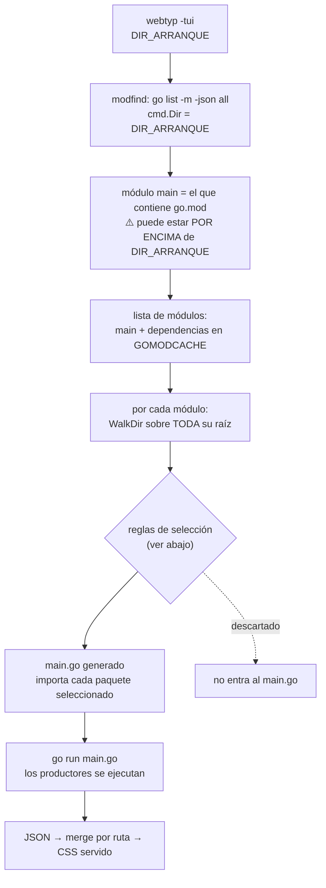
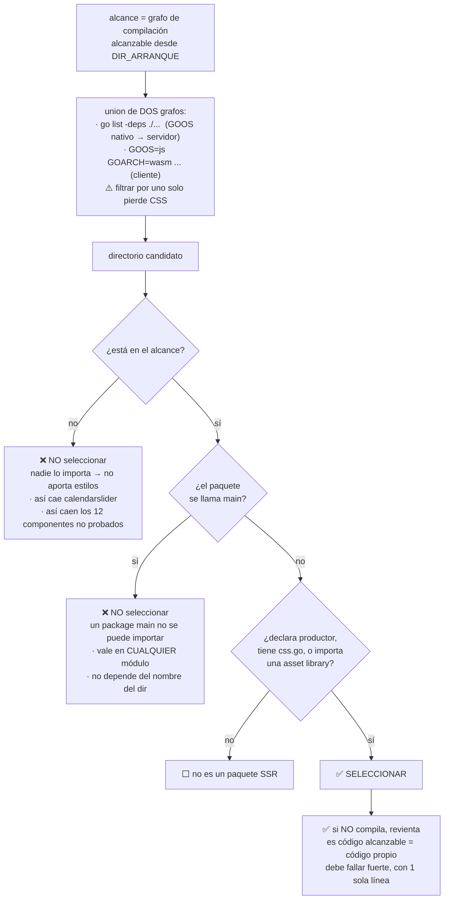
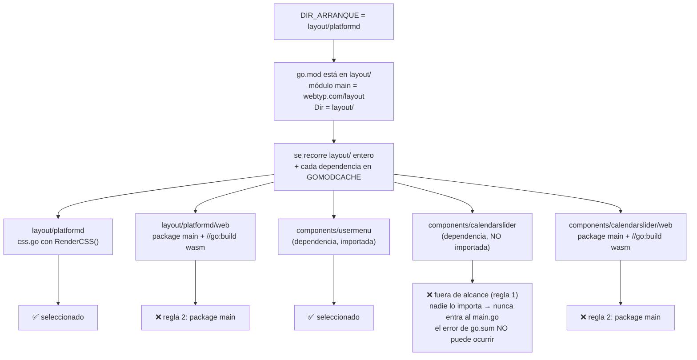
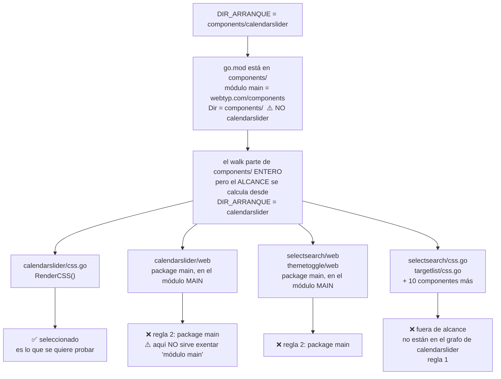

# Selección de paquetes SSR — flujo y los dos casos de arranque

> Documento de verificación en español. El pipeline general está en
> [EXTRACTION.md](EXTRACTION.md) (inglés). Aquí solo interesa **qué paquetes
> entran al `main.go` generado** y por qué, según desde dónde se arranque.

## Premisa: se arranca desde la raíz de lo que se quiere probar

`webtyp -tui` se ejecuta desde el directorio de lo que se prueba, **nunca**
desde su subcarpeta de cliente.

```
✅ cd components/calendarslider && webtyp -tui
❌ cd components/calendarslider/web && webtyp -tui
```

El directorio de arranque **no** es necesariamente la raíz del módulo.

---

## Flujo general



---

## Reglas de selección

El orden importa: **primero se acota el alcance**, y solo dentro de ese alcance
se decide paquete por paquete.



| Regla | Qué elimina |
|---|---|
| 1. Alcance (grafo de compilación) | calendarslider y todo lo que no se usa — **causa raíz** |
| 2. `package main` | demos y entry points, en cualquier módulo |
| 3. Sin productor | directorios que no aportan estilos |

Si el sondeo del grafo falla (sin toolchain), **no se filtra**: se degrada al
comportamiento actual en vez de servir una hoja vacía.

## Caso A — aplicación real

Arranque en `layout/platformd`. El `go.mod` está en `layout/`.



**Hoy** el caso G revienta el `go run` entero → `/style.css` = 0 bytes y la app
sin estilos. **Con el arreglo** calendarslider ni siquiera se considera: no está
en el grafo de compilación, así que el `missing go.sum entry` deja de existir
como clase de fallo. No se "salta un error", se elimina la causa.

---

## Caso B — un solo componente

Arranque en `components/calendarslider`. El `go.mod` está en `components/`,
o sea **por encima** del directorio de arranque.



### Por qué la regla no puede depender del módulo

```
$ cd components/calendarslider && go list -m -json
Path: webtyp.com/components
Dir:  /home/cesar/Dev/Project/webtyp/components    <- raíz del módulo
Main: true
```

En este caso las demos están en el módulo **main**. Una regla del tipo
"saltar `web/` solo en dependencias" dejaría el Caso B sin protección. Por eso
la regla 2 mira **la cláusula `package`**, no el módulo ni el nombre del
directorio.

### El alcance se ancla en DIR_ARRANQUE, no en la raíz del módulo

El walk parte de la raíz del módulo, pero el **filtro** se calcula desde
`DIR_ARRANQUE`. Por eso probar `calendarslider` extrae su grafo y nada más,
aunque el `go.mod` esté dos niveles arriba y el módulo tenga trece componentes.

Medido en `layout/platformd`: servidor 7 paquetes, cliente 8, **unión 9**,
mientras que hoy se importan **13**.

## Resumen de las dos preguntas que decide el flujo

| Pregunta | Caso A | Caso B |
|---|---|---|
| ¿Dónde arranco? | `layout/platformd` | `components/calendarslider` |
| ¿Dónde está el `go.mod`? | `layout/` (un nivel arriba) | `components/` (un nivel arriba) |
| ¿El dir de arranque es la raíz del módulo? | no | no |
| ¿Dónde vive el cliente/demo? | `platformd/web/` | `calendarslider/web/` → propuesta: `example/` |
| ¿Las demos están en el módulo main? | sí (`platformd/web`) | sí (las tres) |
| ¿Qué se recorre? | `layout/` + dependencias | `components/` entero |
| ¿Qué se **extrae** tras el arreglo? | grafo de `platformd` | grafo de `calendarslider` |
| Fallo actual | `/style.css` = 0 bytes | funciona, pero con CSS de 13 componentes |
| Tras el arreglo | 9 paquetes usados, CSS completo | solo el CSS de calendarslider |
